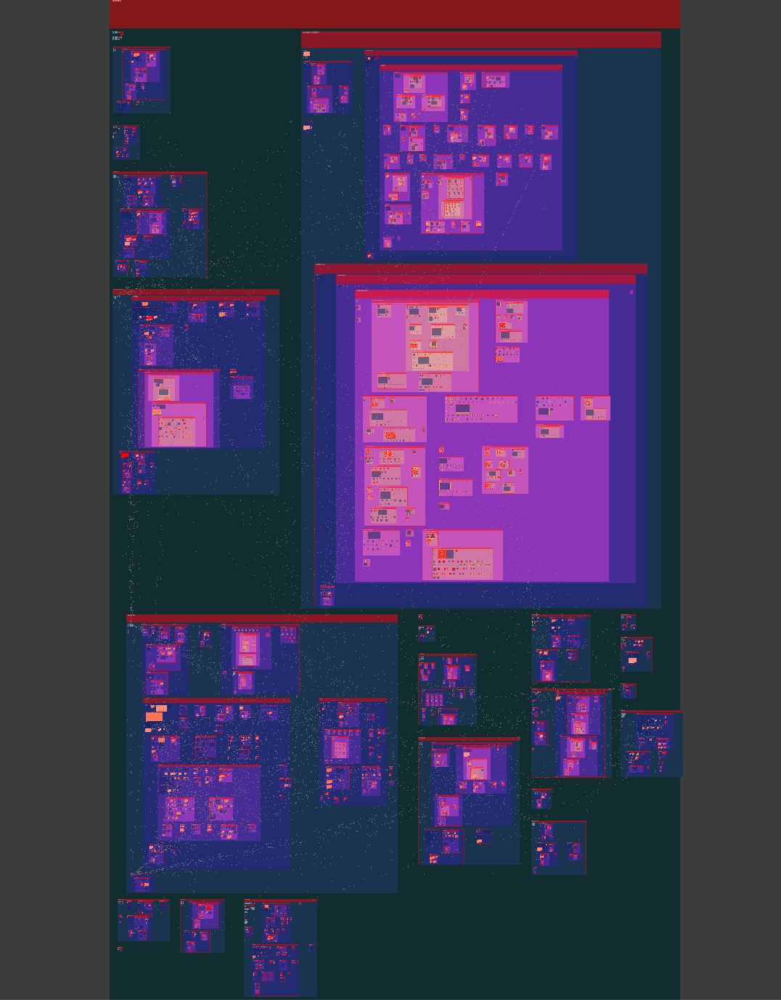

# hypertree

A desktop app for exploring TypeScript/JavaScript codebases as an interactive graph. It analyzes your project structure, imports, and exports, then renders them on a zoomable canvas.



## Requirements

- [Node.js](https://nodejs.org/) and [pnpm](https://pnpm.io/)

## Build

```bash
pnpm install
pnpm build:mac    # macOS
pnpm build:win    # Windows
pnpm build:linux  # Linux
```

Built apps are in the `dist/` folder.

For local development without packaging:

```bash
pnpm install
pnpm dev
```

## Usage

1. Launch the app (from `dist/` or via `pnpm dev`).
2. Click **Open folder…** and choose a repository on disk.
3. Wait for analysis to finish — the graph will appear on the canvas.

The repository you open **must contain a `tsconfig.json`** (or other TypeScript config). Hypertree uses the TypeScript compiler to parse the project; without a config file, analysis will fail.

## TODO

This is a prototype and plenty of features aren't implemented, the most important as of now are:
- **Edge bundling** — group related import/export edges to reduce visual clutter on large graphs
- **LOD (level of detail)** — simplify the view when zoomed out (hide labels, collapse nodes, etc.) to aid learning and improve performance

## License

BSD 3-Clause — see [LICENSE](LICENSE).
